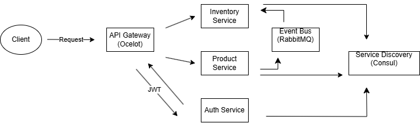

# ECommerce Microservices Architecture

This project demonstrates an eCommerce backend application built with a microservices architecture using .NET Core. It includes Product, Inventory, Order, and Auth services, configured with an API Gateway (Ocelot), event-driven messaging with RabbitMQ, service discovery with Consul, and Docker for containerized deployment.

## Project Overview

This eCommerce backend architecture is designed to showcase the implementation of microservices using .NET Core. Each service operates independently and communicates via event-driven messaging through RabbitMQ. Ocelot is used as an API Gateway to route requests, Consul provides service discovery, and JWT is implemented for secure authentication. Each service is containerized using Docker for scalable deployment.

## Technologies Used

- **.NET Core** - Backend framework for creating API services.
- **RabbitMQ** - For event-driven architecture and service communication.
- **Ocelot** - API Gateway for routing and load balancing.
- **Consul** - Service discovery for managing service registration.
- **JWT (JSON Web Tokens)** - Authentication for secure API access.
- **Docker** - Containerization of each service.

## Architecture Diagram

